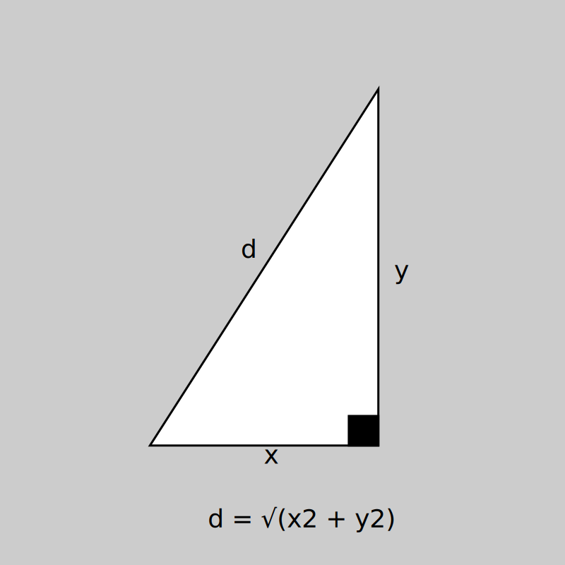

# LEARN-FUNCTIONS

## Invoquer une fonction :
Pour invoquer une fonction, il faire suivre le nom de la fonction de parenthèse.
Entre les parenthèses doivent figurer les arguments nécessaire (zéro, un, ou plusieur) :
```js
// retourne un nombre aléatoire compris entre 0 et 1
Math.random()

// retourne le cosinus de l'angle π
Math.cos(Math.PI)

// retourne la première div présente dans une page html
document.querySelector('div')
```

## Déclarer une fonction : 

Prenons par exemple la [fonction pythagore](https://fr.wikipedia.org/wiki/Th%C3%A9or%C3%A8me_de_Pythagore), qui au couple de nombre (x, y) renvoie la longueur de l'hypothenuse :  


Celle-ci peut-être déclarée de deux manière :
```js
// ceci est une "arrow function"
const pythagore = (x, y) => {
  const x2 = x * x
  const y2 = y * y
  const d2 = x2 + y2
  return Math.sqrt(d2)
}
```
ou avec le mot-clé "function" : 
```js
function pythagore(x, y) {
  const x2 = x * x
  const y2 = y * y
  const d2 = x2 + y2
  return Math.sqrt(d2)
}
```

Le contenu de la fonction ci dessus peut-être "inline" : 
```js
const pythagore = (x, y) => {
  return Math.sqrt(x * x + y * y)
}
```
Lorsqu'une seule ligne se trouve dans le corps d'une fonction, l'écriture peut encore être simplifiée :
```js
const pythagore = (x, y) => Math.sqrt(x * x + y * y)
```